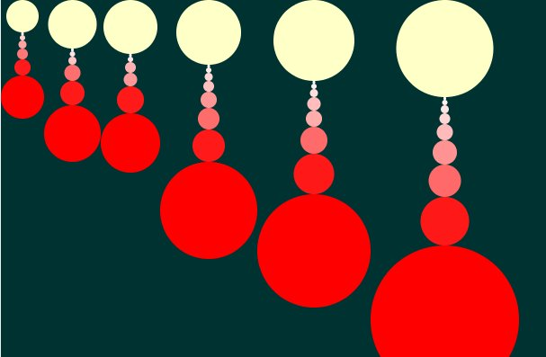

# FutureProgramming
A repository for the *Oriented Objects Programming* course of the [National University of Colombia](http://www.unal.edu.co/).

Powered by [Jimmy Pulido](https://github.com/jiapulidoar)[Sebstian Chaves](https://github.com/adamantwharf)[Laura Santos](https://github.com/lsfinite). 


##Installation

    ```sh
    $ git clone https://github.com/adamantwharf/FutureProgramming.git
    $ cd FutureProgramming
    ```
##Successions

    1. Layland Numbers
        
        Used for create the bionic eye. 
        
        
    2. Abundants Numbers
    
        Graphic representation of succession. 
        
        